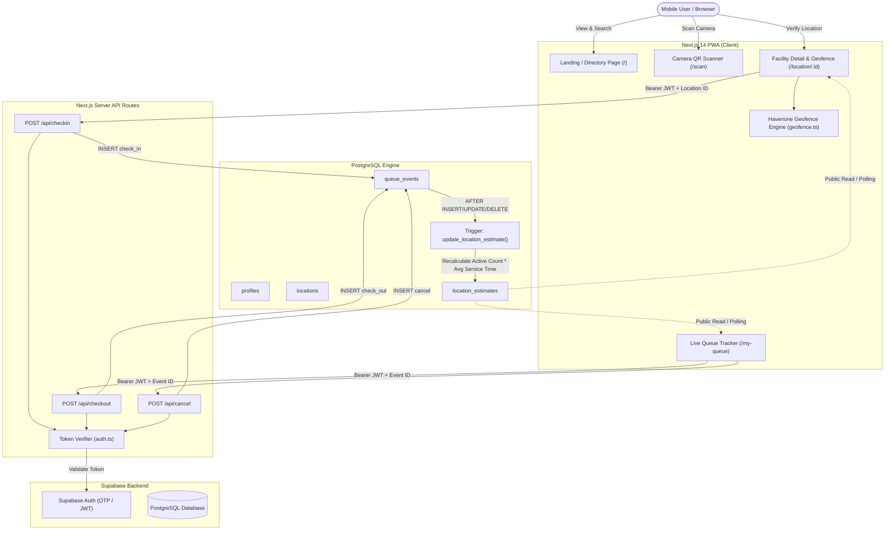

# QWait / QueueEstimater

> **A Location-Aware Smart Queue Management System with Geospatial Geofencing & Event-Driven Wait Estimation.**

[](https://nextjs.org/)
[](https://www.typescriptlang.org/)
[](https://supabase.com/)
[](https://web.dev/progressive-web-apps/)

---

## 1. Overview

### The Problem
Patients and customers lose countless hours physically standing in crowded, opaque queues at clinics, diagnostic labs, and municipal offices without any reliable forecast of how long they will wait. Physical lines cause waiting room crowding, anxiety, cross-infection risks, and wasted personal time.

### The Solution
**QWait (QueueEstimater)** is a lightweight mobile Progressive Web App (PWA) that empowers users to:
1. Discover nearby facilities with real-time queue length and wait-time estimates before leaving home.
2. Verify physical presence on-site using GPS Geofencing (Haversine distance calculation) or verified entrance QR code scanning.
3. Check into a virtual queue with one tap without app store installation.
4. Live-track their position in line with auto-refreshing wait countdowns.
5. Signal when served (checkout) or cancel their place if their plans change, keeping estimates accurate for everyone behind them.

---

## 2. Key Features

- 📍 **GPS-Based Facility Discovery:** Automatically sorts facilities by proximity to device coordinates using browser Geolocation.
- ⏱️ **Real-Time Wait Estimation:** Computes dynamic wait times based on active queue entries and location-specific average service rates.
- 📷 **QR Code Scanner:** Hardware-accelerated camera scanner (`jsQR`) reads location codes directly at entrances.
- 🛡️ **Geofence Verification:** Enforces that users are physically within a facility's permitted radius (e.g. 150m) to prevent remote queue jumping.
- 🔒 **Secure Phone Authentication:** Supabase Auth OTP verification with server-side token validation on all mutations.
- 🛑 **Queue Cancellation & Checkout:** Self-service controls to release or complete spots in line.
- ⚡ **Event-Driven Database Triggers:** PostgreSQL trigger on `queue_events` automatically recomputes aggregate wait times instantaneously upon any event.
- 📱 **Mobile-First PWA Architecture:** Works as an installable home-screen web app on iOS Safari and Android Chrome with zero app store friction.

---

## 3. Tech Stack

| Layer | Technology | Description |
|---|---|---|
| **Frontend** | [Next.js 14](https://nextjs.org/) (App Router), React 18 | High-performance React framework with server and client components |
| **Language** | [TypeScript 5](https://www.typescriptlang.org/) | End-to-end type safety across client and server routes |
| **Styling** | Vanilla CSS Design System | Custom dark theme glassmorphism with responsive mobile constraints |
| **Database & Auth** | [Supabase](https://supabase.com/) / [PostgreSQL](https://www.postgresql.org/) | Managed PostgreSQL with Row-Level Security (RLS) and auth engine |
| **Geospatial** | Browser Geolocation API & Haversine Formula | Mathematical spherical distance computation in TypeScript |
| **QR Scanning** | [jsQR](https://github.com/cozmo/jsQR) | In-browser canvas video stream QR decoder |
| **Mobile / PWA** | Web App Manifest + Service Worker | Offline asset caching and mobile home-screen installability |

---

## 4. Architecture



---

## 5. How It Works

1. **Discovery:** User opens the app. The browser requests device GPS coordinates (`navigator.geolocation`). The app calculates distance to each facility using the **Haversine formula** and sorts by nearest distance.
2. **Arrival & QR Scan:** Upon arrival, the user scans the facility entrance QR code or picks the location from the directory.
3. **Geospatial Verification:**
   - The device coordinates $(lat_{user}, lng_{user})$ are compared against the facility's registered coordinates $(lat_{loc}, lng_{loc})$.
   - If distance $\le$ `geofence_radius_m` (e.g., 150m), geofence passes.
   - If user is outside the radius, check-in is rejected with distance feedback.
   - If GPS permission is blocked on the phone, the user can check in via the verified physical QR code scan fallback.
4. **Server Check-In:** The browser issues `POST /api/checkin` with the user's Supabase JWT. The server extracts the verified `user.id`, validates the geofence server-side, checks for duplicate active check-ins, and records a `check_in` event into `queue_events`.
5. **PostgreSQL Event Trigger:** The database trigger executes `update_location_estimate()`. It calculates the active queue length using `DISTINCT ON (user_id)` and updates `location_estimates`.
6. **Live Tracking:** The user is redirected to `/my-queue` showing their real-time place in line (#) and countdown estimate. Status polls every 20 seconds.
7. **Completion / Exit:** When served, the user taps **"I've Been Served"** (`check_out`). If they need to leave, they tap **"Leave Queue"** (`cancel`). Both events trigger immediate database recalculation.

---

## 6. Queue Estimation Formula

$$\text{Estimated Wait Time} = \text{Active Queue Length} \times \text{Average Service Time per Person}$$

### Concrete Example
- Facility: **General Medicine Clinic A**
- Active Queue Length: **3 patients** waiting in line
- Facility Average Service Time: **12 minutes** per patient

$$\text{Estimated Wait} = 3 \times 12\text{ min} = \mathbf{36\text{ minutes}}$$

When the next patient is called and checks out:
- New Active Queue Length = **2 patients**
- New Estimated Wait = $2 \times 12 = \mathbf{24\text{ minutes}}$

---

## 7. Database Design

The schema is defined in [`supabase_schema.sql`](./supabase_schema.sql).

### Tables

#### 1. `profiles`
Extends Supabase `auth.users` to associate user identity with contact metadata.
- `id` (UUID, Primary Key, references `auth.users(id)`)
- `phone_number` (TEXT)
- `created_at` (TIMESTAMPTZ)

#### 2. `locations`
Registered service facilities (clinics, diagnostic labs, service centers).
- `id` (UUID, Primary Key)
- `name` (TEXT NOT NULL)
- `address` (TEXT)
- `category` (TEXT)
- `lat` (DOUBLE PRECISION NOT NULL)
- `lng` (DOUBLE PRECISION NOT NULL)
- `geofence_radius_m` (INT, default: 150)
- `avg_service_time_minutes` (INT, default: 10)
- `created_at` (TIMESTAMPTZ)

#### 3. `queue_events`
Immutable, append-only event log capturing every lifecycle state change.
- `id` (UUID, Primary Key)
- `location_id` (UUID, references `locations(id)`)
- `user_id` (UUID, references `auth.users(id)`)
- `event_type` (TEXT: `'check_in'`, `'check_out'`, `'cancel'`)
- `gps_lat` (DOUBLE PRECISION, optional)
- `gps_lng` (DOUBLE PRECISION, optional)
- `gps_verified` (BOOLEAN, default: false)
- `created_at` (TIMESTAMPTZ, default: `NOW()`)

#### 4. `location_estimates`
Aggregated materialized view updated automatically by database triggers.
- `location_id` (UUID, Primary Key, references `locations(id)`)
- `current_queue_length` (INT, default: 0)
- `avg_wait_minutes` (NUMERIC, default: 0)
- `last_updated` (TIMESTAMPTZ, default: `NOW()`)

### Why Event Sourcing (`check_in`, `cancel`, `check_out`)?
Instead of mutating a single `status` column on a user row, storing an append-only event stream provides:
1. **Auditability:** Complete historical audit trail of arrival times, cancellations, and visit completions.
2. **Crash Resilience:** Idempotent recomputation of queue state at any point in time.
3. **No Lock Contention:** High write throughput without locking user record rows.
4. **Analytical Potential:** Foundation for future predictive wait-time models and peak-hour analysis.

---

## 8. API Endpoints

All mutating endpoints require a valid Supabase Auth JWT passed via the `Authorization: Bearer <token>` header.

### 1. `POST /api/checkin`
Joins a facility's queue with geospatial verification.

- **Request Headers:**
  - `Authorization: Bearer <jwt_token>`
  - `Content-Type: application/json`
- **Request Body:**
  ```json
  {
    "location_id": "a1b2c3d4-e5f6-7a8b-9c0d-1e2f3a4b5c6d",
    "lat": 37.7749,
    "lng": -122.4194,
    "gps_bypass": false
  }
  ```
- **Success Response (200 OK):**
  ```json
  {
    "success": true,
    "event_id": "e4f5a6b7-c8d9-0e1f-2a3b-4c5d6e7f8a9b",
    "location_name": "General Medicine Clinic A",
    "gps_verified": true,
    "created_at": "2026-09-10T16:45:00Z"
  }
  ```
- **Common Errors:**
  - `400 Bad Request`: Missing `location_id`
  - `401 Unauthorized`: Missing or invalid session token
  - `403 Forbidden`: Outside geofence boundary
  - `404 Not Found`: Facility does not exist
  - `409 Conflict`: User already has an active check-in at this location
  - `503 Service Unavailable`: Database connection offline

---

### 2. `POST /api/checkout`
Records that the authenticated user has been served and leaves the queue.

- **Request Headers:**
  - `Authorization: Bearer <jwt_token>`
- **Request Body:**
  ```json
  {
    "queue_event_id": "e4f5a6b7-c8d9-0e1f-2a3b-4c5d6e7f8a9b",
    "location_id": "a1b2c3d4-e5f6-7a8b-9c0d-1e2f3a4b5c6d"
  }
  ```
- **Success Response (200 OK):**
  ```json
  {
    "success": true,
    "event_id": "f5a6b7c8-d9e0-1f2a-3b4c-5d6e7f8a9b0c",
    "message": "Checkout recorded successfully. Thank you for updating the queue!"
  }
  ```
- **Common Errors:**
  - `401 Unauthorized`: Missing auth token
  - `403 Forbidden`: User attempts to checkout another user's queue entry
  - `404 Not Found`: Original check-in record not found

---

### 3. `POST /api/cancel`
Cancels the user's active spot in line.

- **Request Headers:**
  - `Authorization: Bearer <jwt_token>`
- **Request Body:**
  ```json
  {
    "queue_event_id": "e4f5a6b7-c8d9-0e1f-2a3b-4c5d6e7f8a9b",
    "location_id": "a1b2c3d4-e5f6-7a8b-9c0d-1e2f3a4b5c6d"
  }
  ```
- **Success Response (200 OK):**
  ```json
  {
    "success": true,
    "event_id": "a7b8c9d0-e1f2-3a4b-5c6d-7e8f9a0b1c2d",
    "message": "Queue entry successfully cancelled."
  }
  ```
- **Common Errors:**
  - `401 Unauthorized`: Missing auth token
  - `403 Forbidden`: User attempts to cancel another user's entry

---

## 9. Project Structure

```
QueueEstimater/
├── public/
│   ├── icons/                 # PWA adaptive icons (192px, 512px)
│   ├── manifest.json          # Web App Manifest for mobile installation
│   └── sw.js                  # Service worker for offline asset caching
├── src/
│   ├── app/
│   │   ├── api/
│   │   │   ├── cancel/        # POST /api/cancel
│   │   │   ├── checkin/       # POST /api/checkin
│   │   │   └── checkout/      # POST /api/checkout
│   │   ├── location/[id]/     # Facility wait details & geofenced check-in
│   │   ├── login/             # OTP phone authentication
│   │   ├── my-queue/          # Live wait countdown & queue position tracker
│   │   ├── scan/              # In-browser hardware camera QR scanner
│   │   ├── globals.css        # Premium dark glassmorphism design system
│   │   ├── layout.tsx         # Root layout with mobile viewport constraints
│   │   └── page.tsx           # Facility directory sorted by GPS proximity
│   ├── components/
│   │   └── PwaRegister.tsx    # Service worker lifecycle registrar
│   └── lib/
│       ├── auth.ts            # Server-side JWT token verification helper
│       ├── geofence.ts        # Haversine geodesic distance implementation
│       └── supabase.ts        # Public client & privileged server admin client
├── supabase_schema.sql        # Database tables, RLS policies, indexes & triggers
├── .env.local.example         # Template for environment configuration
├── tsconfig.json              # Strict TypeScript configuration
└── package.json               # Dependencies and scripts
```

---

## 10. Environment Variables

Create a local configuration file named `.env.local` based on `.env.local.example`:

```bash
cp .env.local.example .env.local
```

Configure the following variables:

```env
# Supabase Public API Settings (Required for frontend client)
NEXT_PUBLIC_SUPABASE_URL=https://YOUR-PROJECT-ID.supabase.co
NEXT_PUBLIC_SUPABASE_ANON_KEY=YOUR-SUPABASE-ANON-KEY-HERE

# Supabase Service Key (Server-side API routes only; NEVER expose to client!)
SUPABASE_SERVICE_ROLE_KEY=YOUR-SERVICE-ROLE-KEY-HERE
```

> [!IMPORTANT]
> Never commit `.env.local` to source control. Only commit `.env.local.example` with sanitized placeholder tokens.

---

## 11. Local Setup

### Prerequisites
- Node.js 18+ or 20+
- npm, yarn, or pnpm

### 1. Install Dependencies
```bash
npm install
```

### 2. Configure Database (Supabase)
1. Create a free project at [supabase.com](https://supabase.com).
2. Open the **SQL Editor** in your Supabase dashboard.
3. Paste and execute the contents of [`supabase_schema.sql`](./supabase_schema.sql).
4. Copy your project URL, Anon Key, and Service Role Key into `.env.local`.

### 3. Run the Development Server
```bash
npm run dev
```

Open [http://localhost:3000](http://localhost:3000) on your phone or browser.

---

## 12. Manual Test Checklist

Use this checklist during examination and viva demonstration:

- [x] **Authentication:** Open `/login`, enter mobile number, verify OTP (`123456` in demo mode).
- [x] **Directory Search:** Filter facilities by name or category on `/` search bar. Clear filter resets view.
- [x] **GPS Proximity:** Tap **Show Nearest (Request GPS)** on `/` to sort facilities by distance.
- [x] **QR Camera Scanner:** Navigate to `/scan`, grant camera permission, scan QR or pick quick-test preset.
- [x] **Valid Geofence:** Check in when physically within facility radius. Check-in succeeds and creates active queue entry.
- [x] **Invalid Geofence:** Attempt check-in when outside radius without scanning on-site QR. System blocks check-in with distance meter.
- [x] **Duplicate Check-In:** Attempt to check in twice at the same facility. System returns conflict message and directs to `/my-queue`.
- [x] **Live Tracking:** Verify `/my-queue` renders queue position (`#X`), countdown estimate, and background refresh indicator.
- [x] **Queue Cancellation:** Tap **Leave Queue**; confirmation modal appears; confirming releases the spot and redirects home.
- [x] **Checkout:** Tap **I've Been Served**; checkout event is recorded and active queue length decrements.
- [x] **Offline / Simulation Mode:** App runs seamlessly with simulated data even if Supabase keys are unset.
- [x] **Mobile Responsiveness:** Viewport conforms cleanly to phone dimensions (375px - 430px) without horizontal scrolling.

---

## 13. Why This Project is Technically Interesting (Viva Points)

### 1. Geospatial Verification (GPS + Haversine Formula)
Instead of relying on naive planar Euclidean distance, the application calculates geodesic surface distance using the **Haversine formula**:

$$d = 2R \arcsin\left(\sqrt{\sin^2\left(\frac{\Delta\phi}{2}\right) + \cos(\phi_1)\cos(\phi_2)\sin^2\left(\frac{\Delta\lambda}{2}\right)}\right)$$

Where $R = 6,371\text{ km}$ (mean Earth radius), $\phi$ is latitude, and $\lambda$ is longitude in radians. This ensures sub-meter precision for tight geofencing thresholds (e.g. 100m–200m) without external paid map APIs.

### 2. Event-Driven Queue Management (Event Sourcing)
Queue entries are not stored as mutable rows that get modified or deleted. Instead, every state transition (`check_in`, `cancel`, `check_out`) is recorded as an immutable event in `queue_events`. This ensures complete auditability, zero record lock contention, and full recovery capability if services restart.

### 3. Database-Driven Wait Estimation (PostgreSQL Triggers)
Rather than calculating wait times in memory on a single web server (which fails with multiple server instances), queue estimation logic lives directly inside a PostgreSQL trigger (`update_location_estimate`). Any check-in, checkout, or cancellation across any client atomically updates `location_estimates` in a single database transaction, ensuring consistent estimates across all users.

---

## 14. Future Improvements

Realistic enhancements planned for future iterations:
- **Historical Queue Analytics:** Machine learning models that analyze time-of-day and day-of-week arrival patterns to predict wait fluctuations before queues form.
- **Push & SMS Notifications:** Automated Web Push / Twilio SMS alerts when a user's position advances to the top 3 in line.
- **Clinic Staff Dashboard:** Dedicated staff portal to call patients, hold spots, and dynamically adjust service time estimates based on real-time consultation duration.
